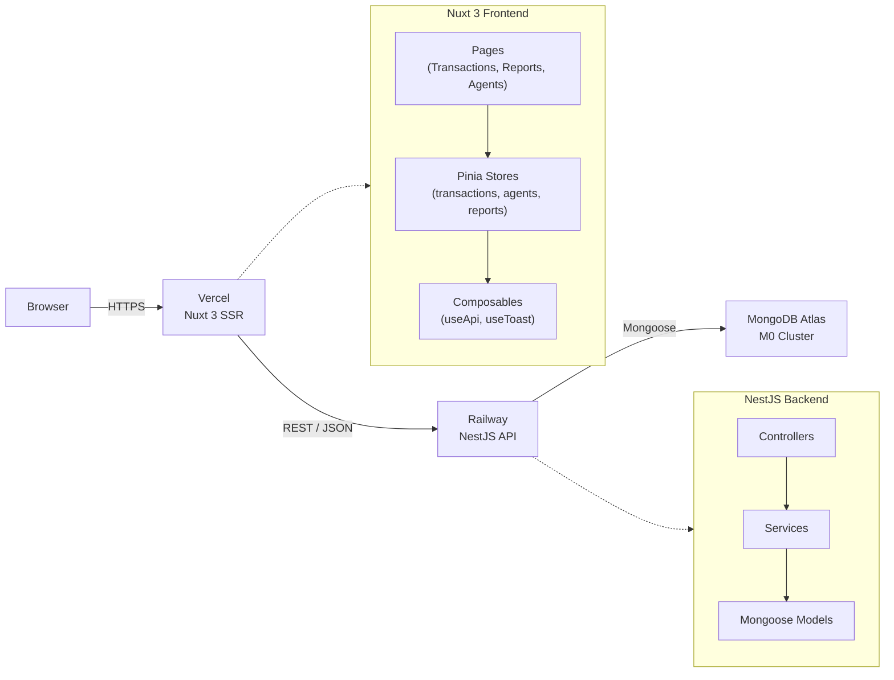
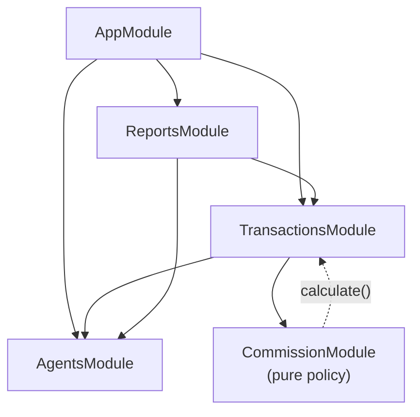

# Design Decisions

## System Overview



## Module Graph



`CommissionModule` is a pure, dependency-free policy container. `TransactionsService` depends on `AgentsService` to validate agent existence before creation. `ReportsModule` is read-only and pulls from both collections for aggregations.

## Architecture

**Layered monolith:** Controllers → Services → Mongoose models. No CQRS, no event sourcing — the domain (4 stages, 2 entity types, 1 computed value) is simple enough that adding those patterns would obscure rather than clarify the code. A flat NestJS module graph is easy to navigate and extend if requirements grow.

**Monorepo structure:** `backend/` and `frontend/` share a single git repository. This keeps related code together, simplifies local development, and makes it trivial to verify frontend/backend type contracts by inspection rather than package versioning.

---

## Data Modeling

### Transaction as the aggregate root

All transaction-related data lives in one MongoDB document:

```
Transaction {
  propertyAddress, salePrice, totalServiceFee
  listingAgentId, sellingAgentId        ← references to Agent
  stage                                 ← current state
  stageHistory[]                        ← append-only audit log
  commissionBreakdown                   ← embedded, set once at completion
}
```

**Why embed the commission breakdown instead of computing it on read?**

Three reasons:
1. **Immutability** — once a transaction reaches `completed`, its financial record must not change even if business rules change. Embedding locks the snapshot.
2. **Read performance** — the breakdown is always displayed with the transaction; a separate collection would require a join on every detail page.
3. **Simplicity** — no cross-document consistency to manage.

### Agent as a thin entity

Agents hold only identity data (name, email, phone). Commission policy and transaction history are derived from the transaction side, not stored on the agent. This avoids denormalisation and keeps the agent document from growing as transaction volume scales.

---

## Commission Policy

```
agencyAmount      = totalServiceFee × 0.50
agentPool         = totalServiceFee × 0.50

if listingAgentId === sellingAgentId:
  listingAgentAmount = agentPool        # sole agent takes full pool
  sellingAgentAmount = 0

else:
  listingAgentAmount = agentPool × 0.5  # 25% each
  sellingAgentAmount = agentPool × 0.5
```

**Implementation choice:** The logic lives entirely in `CommissionService.calculate()` — a pure function with no database access and no side effects. This makes it:
- **Trivially unit-testable** (no mocking required; just `new CommissionService().calculate(...)`)
- **Easy to audit** (the entire policy is 10 lines)
- **Easy to extend** (e.g. a third agent type would require editing one function and its tests)

The service is called once in `TransactionsService.advanceStage()` at the moment of transition to `completed`, and its output is immediately embedded in the document.

---

## Stage Transition Rules

```
agreement → earnest_money → title_deed → completed
```

**Forward-only, no skipping.** Each stage represents an irreversible real-world legal event:

| Stage | Real-world event |
|---|---|
| `agreement` | Purchase agreement signed |
| `earnest_money` | Earnest money deposited |
| `title_deed` | Title deed transferred |
| `completed` | Transaction closed |

Attempting to advance a `completed` transaction returns `400 Bad Request`. Attempting to skip a stage (e.g. agreement → title_deed) is impossible because the API only advances one step.

**Implementation:** `getNextStage()` in `stage-transitions.ts` is a pure lookup function tested in isolation. The service calls it without knowing the ordering logic; if the order ever changes, only `stage-transitions.ts` changes.

---

## Validation Strategy

**Backend (authoritative):**
- `class-validator` decorators on DTOs (`@IsString`, `@IsEmail`, `@IsMongoId`, `@IsPositive`)
- `ValidationPipe({ whitelist: true, transform: true })` strips unknown fields and coerces types globally
- Business-rule validation (invalid stage transition) throws `BadRequestException` in the service

**Frontend (UX layer):**
- HTML5 `required` / `type="email"` / `type="number"` on form inputs for immediate feedback
- Agent selects are populated from the live agent list, making it impossible to submit an invalid agent ID

The backend never trusts the frontend; validation is duplicated intentionally.

---

## Error Handling

| Scenario | HTTP status | Where |
|---|---|---|
| Resource not found (agent, transaction) | 404 | Service layer (`NotFoundException`) |
| Invalid stage advance / already completed | 400 | Service layer (`BadRequestException`) |
| Validation failure (bad body) | 400 | `ValidationPipe` (global) |
| Duplicate email on agent creation | 409 | Service layer (`ConflictException`) — Mongoose duplicate-key (`E11000`) caught and rethrown |

---

## Frontend State Management

Pinia stores (`transactions`, `agents`) own all server state. Pages call store actions; components receive props only — no component fetches data directly. This keeps components purely presentational and makes the data flow linear and easy to trace.

The `useApi` composable centralises `baseURL` from `runtimeConfig.public.apiBase`. Changing the API endpoint (e.g. switching from local to deployed Railway URL) requires changing one environment variable.

---

## Reporting Layer

Three design choices:

1. **Separate `ReportsModule`** — aggregations don't belong in `TransactionsService` (which owns lifecycle) or `AgentsService` (which owns identity). A dedicated read-only module keeps the separation clean.
2. **In-memory aggregation from `.lean()` queries** — the dataset size (one agency's transactions) doesn't justify MongoDB aggregation pipelines; plain TypeScript reductions are easier to read, easier to test, and fast enough.
3. **Same-agent transactions count once** — in agent leaderboard, a transaction where the same agent is both listing and selling increments `completedTransactions` once (not twice) for that agent. This matches commission policy (they receive the full agent pool, not split) and intuitive "how many deals closed" semantics.

Two endpoints:
- `GET /reports/summary` — totals + pipeline + stage distribution
- `GET /reports/agents` — per-agent earnings, sorted by total

## API Documentation

**Swagger / OpenAPI** at `/api/docs` via `@nestjs/swagger`. DTOs carry `@ApiProperty` decorators with realistic examples. This turns the API into a self-documenting, interactive surface that evaluators can test directly in the browser without Postman.

## Testing Strategy

| File | Approach | Tests |
|---|---|---|
| `commission.service.spec.ts` | Pure unit (no mocks) | Agency 50% rule, Scenario 1 (same agent), Scenario 2 (different agents), sum invariant on both paths |
| `stage-transitions.spec.ts` | Pure unit (no mocks) | All 3 valid transitions, null on completed, enum length guard |
| `transactions.service.spec.ts` | Unit with mocks | Stage advance + history append, commission embedding at completion, 400 on advancing completed, 404 on missing transaction |
| `reports.service.spec.ts` | Unit with mocks | Summary aggregation, stage distribution, empty-database edge case, agent leaderboard ranking, same-agent edge case |
| `agents.service.spec.ts` | Unit with mocks | Successful create, **409 Conflict on duplicate email (E11000)**, rethrow on unrelated errors, 404 on missing agent |
| `app.controller.spec.ts` | Unit | Root endpoint returns API metadata (name, version, docs path, endpoint links) |

**24 tests across 6 suites, all passing** (`npx jest --rootDir . --no-coverage`). The commission service, stage-transition utility, and reports aggregation are pure/near-pure functions — no database, minimal DI. This makes them the fastest and most reliable tests in the suite and maps directly to §4.3 (commission policy) and §4.1 (stage lifecycle) of the brief.

## CI/CD

**GitHub Actions** (`.github/workflows/ci.yml`) runs on every push and PR:
- Backend: `npm ci` → ESLint (zero warnings) → Jest → `nest build`
- Frontend: `npm ci` → `nuxt prepare` → `nuxt build`

Catches regressions before they reach `main`. Cache is keyed on `package-lock.json` for fast runs.

---

## Deployment

| Layer | Platform | Notes |
|---|---|---|
| Database | MongoDB Atlas M0 | Free tier, connection via `MONGODB_URI` env var |
| Backend API | Railway | `Procfile` runs `npm run start:prod`; env vars set in Railway dashboard |
| Frontend | Vercel | Auto-detects Nuxt 3 via `vercel.json`; `NUXT_PUBLIC_API_BASE` points to Railway URL |

**Why Railway for the backend?** Railway natively supports Node.js processes via `Procfile`, provides environment variable management, and offers a free tier sufficient for this project. Zero Dockerfile required.

**Why Vercel for the frontend?** First-class Nuxt 3 support with automatic SSR/static detection. The `vercel.json` specifies the framework and output directory; everything else is automatic.
