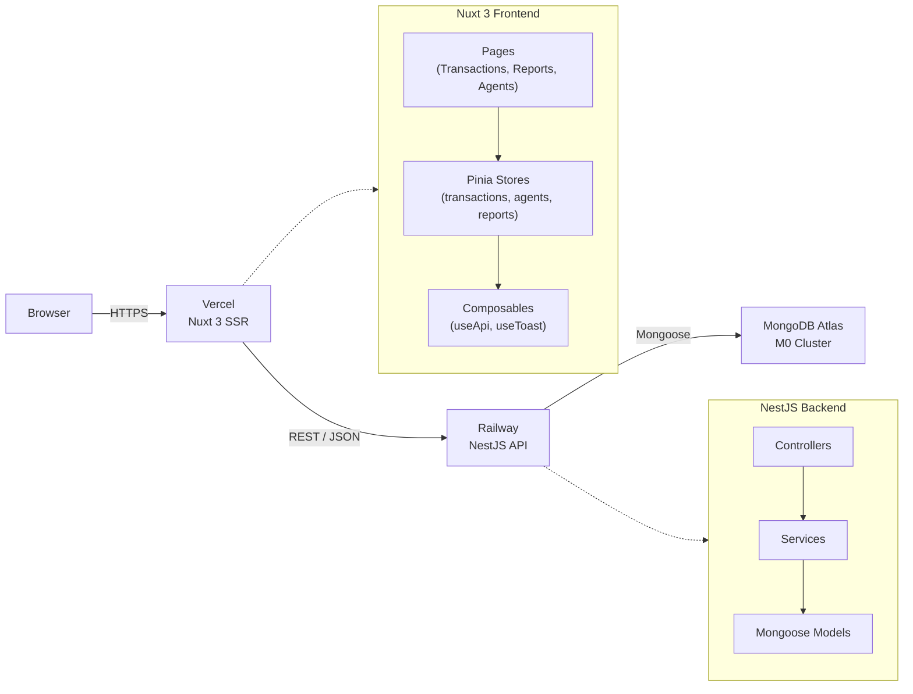
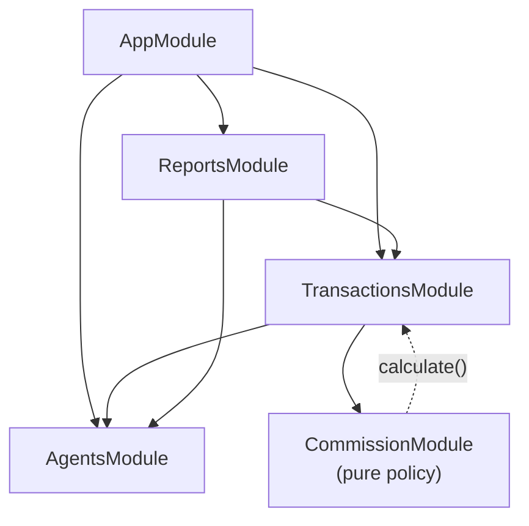
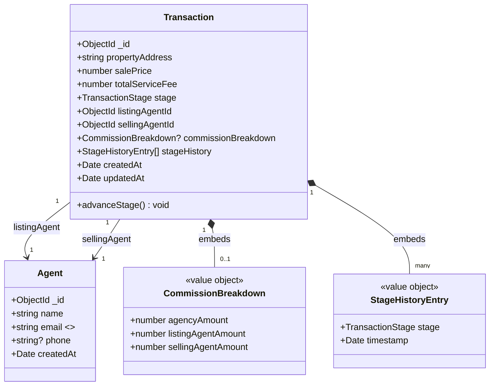

# Design Decisions

## System Overview



## Module Graph



`CommissionModule` is a pure, dependency-free policy container. `TransactionsService` depends on `AgentsService` to validate agent existence before creation. `ReportsModule` is read-only and pulls from both collections for aggregations.

## Architecture

**Layered monolith:** Controllers → Services → Mongoose models. No CQRS, no event sourcing — the domain (4 stages, 2 entity types, 1 computed value) is simple enough that adding those patterns would obscure rather than clarify the code. A flat NestJS module graph is easy to navigate and extend if requirements grow.

**Monorepo structure:** `backend/` and `frontend/` share a single git repository. This keeps related code together, simplifies local development, and makes it trivial to verify frontend/backend type contracts by inspection rather than package versioning.

---

## Domain Model

The business is modelled with **two entities** and **one value object**, intentionally kept minimal.



### Entities

- **Agent** — the identity of a person at the agency. Thin by design: only name, email, optional phone. Does **not** store transaction history, earnings, or role; those are derived from the transaction side.
- **Transaction** — the aggregate root of the business. Owns its lifecycle (`stage`), its audit trail (`stageHistory`), and its financial outcome (`commissionBreakdown`).

### Value Objects (embedded, immutable)

- **CommissionBreakdown** — `{ agencyAmount, listingAgentAmount, sellingAgentAmount }`. Written once at the transition to `completed`; never modified afterwards.
- **StageHistoryEntry** — `{ stage, timestamp }`. Append-only; each stage change adds one entry.

### Relationships

- A `Transaction` references exactly two agents via `listingAgentId` and `sellingAgentId`. These **may point to the same agent** — this is a supported domain scenario (sole agent on both sides) and is explicitly handled by the commission calculation.
- An `Agent` has no back-reference to transactions. All agent-related aggregations (total earned, deals closed) are computed by querying the transaction collection. This avoids a dual-write problem and keeps the agent document compact.

### Domain Invariants

| # | Invariant | Enforced by |
|---|---|---|
| I-1 | Every transaction references two existing agents (possibly the same) | `TransactionsService.create()` validates both IDs against `AgentsService` before insert |
| I-2 | `stage` only advances forward, one step at a time | `getNextStage()` pure function + service-layer guard → 400 |
| I-3 | `commissionBreakdown` is `null` until `stage === 'completed'`, then set exactly once and never modified | Default `null` in schema; `advanceStage()` populates it only on the terminal transition |
| I-4 | `stageHistory` is strictly append-only | Service only pushes; no endpoint exposes edit or delete |
| I-5 | Two agents cannot share an email address | Mongoose `unique: true` index + `E11000 → 409 Conflict` mapping |
| I-6 | `salePrice` and `totalServiceFee` are positive numbers | `@IsPositive()` DTO validation + application-level checks |

Every invariant is enforced **at the service layer** (authoritative) and additionally defended at the schema or validation layer where practical — see [Validation Strategy](#validation-strategy) and [Stage Transition Rules](#stage-transition-rules) for the "defense in depth" pattern.

---

## Key Architectural Decisions

Summary of the major design decisions and the "why" behind each. Each row links to the section where it's discussed in depth.

| # | Decision | Alternative rejected | Rationale |
|---|---|---|---|
| AD-01 | **Layered monolith** (NestJS modules → services → Mongoose) | CQRS / event sourcing / hexagonal with ports & adapters | Domain fits on one page (4 stages, 2 entities). Extra patterns would add ceremony without reducing risk. See [Architecture](#architecture). |
| AD-02 | **Transaction as aggregate root** with embedded breakdown & history | Separate `commissions` and `stage_events` collections | All transaction state is co-located → single-document reads, atomic writes, immutable financial snapshot. See [Financial Breakdown](#financial-breakdown-42). |
| AD-03 | **Agent as a thin entity** (no embedded earnings) | Denormalise totals onto the agent document for faster reads | Dual-write complexity isn't justified at this scale; aggregation is fast enough from transactions. See [Domain Model](#domain-model). |
| AD-04 | **`CommissionService` is a pure function** (no DB, no DI on its logic) | Commission logic inside `TransactionsService` with DB access | Pure functions are trivially testable and auditable; the whole policy is 10 lines. See [Commission Calculation](#commission-calculation). |
| AD-05 | **Server-side enforcement of stage transitions**, frontend is UX-only | Trust the frontend to send valid transitions | Backend is authoritative; frontend check is a safety net, not a gate. See [Stage Transition Rules](#stage-transition-rules). |
| AD-06 | **Pinia stores own all server state**; components are props-only | Components fetch their own data | Unidirectional data flow; components stay presentational and testable. See [State Management](#state-management). |
| AD-07 | **REST + JSON over a typed service contract** | GraphQL / tRPC | REST + Swagger/OpenAPI covers every endpoint here (4 resources, CRUD + 1 action); GraphQL's benefits (over-fetch avoidance, schema negotiation) wouldn't earn their complexity. |
| AD-08 | **MongoDB over a relational DB** | PostgreSQL with JSONB columns | Document model maps 1-to-1 to the aggregate (`Transaction` = document); Atlas M0 free tier is sufficient; no multi-table transactions needed. See [MongoDB Schema Strategy](#mongodb-schema-strategy). |
| AD-09 | **Split platforms: Railway (API) + Vercel (web) + Atlas (DB)** | Single PaaS (Render, Fly.io) | Each platform is best-in-class for its layer and has a free tier. See [Deployment](#deployment). |

These decisions are deliberately biased toward **removing** options rather than adding them. The brief defines a narrow problem, and the design follows its shape rather than anticipating imagined future requirements.

---

## MongoDB Schema Strategy

Two collections, no more. The schema is shaped by the [Domain Model](#domain-model) and the invariants listed there.

### Collections

| Collection | Role | Document shape |
|---|---|---|
| `agents` | Identity registry | `{ name, email (unique), phone?, createdAt }` |
| `transactions` | Aggregate root | `{ propertyAddress, salePrice, totalServiceFee, stage, listingAgentId, sellingAgentId, commissionBreakdown?, stageHistory[], createdAt, updatedAt }` |

### Embed vs. Reference Decisions

| What | Choice | Why |
|---|---|---|
| `commissionBreakdown` inside transaction | **Embed** | Written once, read with parent, must be immutable → see [Financial Breakdown §4.2](#financial-breakdown-42) |
| `stageHistory[]` inside transaction | **Embed** | Append-only, bounded (≤4 entries), always shown with the transaction |
| `listingAgentId` / `sellingAgentId` | **Reference** (`ObjectId` + `ref: 'Agent'`) | Agents exist independently and are reused across transactions; embedding would duplicate their data |

MongoDB's general rule applies: **embed what is owned by the parent and bounded in size; reference what has an independent lifecycle.**

### Indexes

| Index | Collection | Purpose |
|---|---|---|
| `{ email: 1 }` (unique) | `agents` | Enforces domain invariant I-5; surfaces as 409 Conflict |
| `{ stage: 1 }` | `transactions` | Dashboard filtering by stage |
| `{ listingAgentId: 1 }` | `transactions` | Agent leaderboard / profile views |
| `{ sellingAgentId: 1 }` | `transactions` | Agent leaderboard / profile views |
| `{ createdAt: -1 }` | `transactions` | Default sort on the main dashboard |

Indexes are declared next to the schema (`TransactionSchema.index(...)`) so they live beside the code that relies on them.

### Timestamps

- **Transaction:** `{ timestamps: true }` — both `createdAt` and `updatedAt`. Transactions are mutable (stage advances, history appends), so `updatedAt` is meaningful.
- **Agent:** `{ timestamps: { createdAt: true, updatedAt: false } }` — agents are rarely mutated; `createdAt` is the only time data that matters for onboarding analytics, and omitting `updatedAt` keeps the document leaner.

### Schema-Level Guards

- **`stage` enum** — `['agreement', 'earnest_money', 'title_deed', 'completed']` declared at the schema. Rejects malformed values even if the service layer is bypassed (e.g. direct `db.collection.insert()`).
- **Required flags** on every non-optional domain field, so a missing `totalServiceFee` or `propertyAddress` fails fast rather than writing a half-formed document.
- **`commissionBreakdown` defaults to `null`** — the schema treats "not yet computed" as a first-class state rather than a missing field.

### What the Schema Does **Not** Enforce

- **Valid agent references.** Mongoose refs are pointers, not foreign keys; MongoDB doesn't verify the agent actually exists. That check is done explicitly in `TransactionsService.create()` (invariant I-1).
- **Forward-only stage transitions.** The enum allows any of the 4 values, so a direct DB write could still move `completed` → `agreement`. Application-layer enforcement (`getNextStage()`) closes this gap (invariant I-2).

Defending the same invariant at multiple layers is intentional — see the ["Defense in Depth" table](#defense-in-depth-three-layers) under Stage Transition Rules.

---

## Commission Calculation

```
agencyAmount      = totalServiceFee × 0.50
agentPool         = totalServiceFee × 0.50

if listingAgentId === sellingAgentId:
  listingAgentAmount = agentPool        # sole agent takes full pool
  sellingAgentAmount = 0

else:
  listingAgentAmount = agentPool × 0.5  # 25% each
  sellingAgentAmount = agentPool × 0.5
```

**Implementation choice:** The logic lives entirely in `CommissionService.calculate()` — a pure function with no database access and no side effects. This makes it:
- **Trivially unit-testable** (no mocking required; just `new CommissionService().calculate(...)`)
- **Easy to audit** (the entire policy is 10 lines)
- **Easy to extend** (e.g. a third agent type would require editing one function and its tests)

The service is called once in `TransactionsService.advanceStage()` at the moment of transition to `completed`, and its output is immediately embedded in the document.

---

## Financial Breakdown (§4.2)

The brief requires the system to report, for every completed transaction, **how much the agency earned, how much each agent earned, and why** (listing vs. selling role). It leaves the storage strategy open — embed, dedicated collection, or compute dynamically.

### Storage Options Considered

| Option | Pros | Cons | Verdict |
|---|---|---|---|
| **Embed in the transaction document** | Atomic write with the stage transition; immutable by construction; single read serves detail page; no joins | Denormalised (agency split % frozen at completion time) | **Chosen** |
| Dedicated `commissions` collection | Easier to evolve commission-specific fields (e.g. payout status) | Extra join on every read; cross-document consistency (two-phase writes) without MongoDB transactions; more moving parts for a value that never changes after completion | Rejected |
| Compute dynamically on read | Always reflects current policy | Breaks immutability — a future policy change would retroactively alter historical records; reports must recompute on every request | Rejected |

### Why Embed Wins Here

The commission breakdown has three properties that strongly favour embedding:

1. **It is write-once, read-many.** Once a transaction hits `completed`, the breakdown is never edited. A dedicated collection's flexibility is wasted.
2. **It must be immutable.** If the agency changes its 50/50 split to 60/40 next year, last year's completed transactions must still show 50/50. Embedding freezes the snapshot; dynamic computation cannot.
3. **It is always read with its parent.** Every view that shows a commission also shows the transaction (address, price, stage). A single-document read is both simpler and faster than a lookup.

### Shape of the Embedded Breakdown

```ts
commissionBreakdown: {
  agencyAmount:        number,  // 50% of totalServiceFee
  listingAgentAmount:  number,  // share of the 50% agent pool, based on role
  sellingAgentAmount:  number,  // share of the 50% agent pool, based on role
} | null                        // null until stage === 'completed'
```

Combined with the transaction's own `listingAgentId` and `sellingAgentId`, this answers all three §4.2 questions in a single read:

| §4.2 question | Answered by |
|---|---|
| How much did the agency earn? | `commissionBreakdown.agencyAmount` |
| How much did each agent earn? | `listingAgentAmount` + `sellingAgentAmount` |
| **Why** did they earn that amount? | The **field names themselves** encode the role — the listing agent earned `listingAgentAmount`, the selling agent earned `sellingAgentAmount`. Pairing with `listingAgentId` / `sellingAgentId` gives the "who + why" without any extra lookup. |

This shape also gracefully handles the same-agent edge case: `listingAgentAmount` holds the full agent pool and `sellingAgentAmount` is `0`, making the role distinction explicit in data rather than inferred at read time.

### Consumption Points

- **Transaction detail page** (`pages/transactions/[id].vue`) renders the three amounts side by side with the two agent names, directly from the embedded object.
- **Reports layer** (`GET /reports/agents`) sums `listingAgentAmount` over transactions where the agent is the listing agent, and `sellingAgentAmount` where they are the selling agent, then merges — see the [Reporting Layer](#reporting-layer) section. Because the breakdown is embedded, this aggregation is a single collection scan with no `$lookup`.

### Trade-off Accepted

If the agency ever needs to adjust a historical commission (e.g. a corrective entry), the current design requires a migration rather than a simple policy change. This is the correct trade-off: financial records should be hard to rewrite, and explicit migrations are auditable where silent recomputation is not.

---

## Stage Transition Rules

```
agreement → earnest_money → title_deed → completed
```

### Decision on §4.1 — "Optionally prevent invalid transitions"

The brief leaves this as a design choice. **I decided to prevent invalid transitions**, because each stage represents an irreversible real-world legal event:

| Stage | Real-world event |
|---|---|
| `agreement` | Purchase agreement signed |
| `earnest_money` | Earnest money deposited |
| `title_deed` | Title deed transferred |
| `completed` | Transaction closed |

Once earnest money is deposited you cannot "un-deposit" it; once a title deed is transferred you cannot reverse it from the system's point of view. Allowing free-form transitions would require the system to model refunds, reversals, and audits that are out of scope for this case. Constraining transitions keeps the audit trail trustworthy and the reporting layer simple (a `completed` transaction's commission breakdown never changes).

### Policy

- **Forward-only:** no backward or skipping transitions
- **One step at a time:** advance one stage per request — skipping is impossible by construction
- **Terminal state:** `completed` is irreversible; attempts to advance return **400 Bad Request**

### Defense in Depth (Three Layers)

| Layer | Mechanism | What it catches |
|---|---|---|
| **API / Service** | `TransactionsService.advanceStage()` calls the pure `getNextStage()` helper; returns `400` when the transaction is already `completed` | Programmatic callers attempting to advance past the terminal state |
| **Database** | Mongoose `enum: ['agreement', 'earnest_money', 'title_deed', 'completed']` at the schema level | Direct writes with unknown/malformed stage values |
| **Frontend** | "Advance to …" button is hidden when `stage === 'completed'` and replaced with a "Transaction completed" badge (`pages/transactions/[id].vue`) | User cannot even attempt an invalid click |

The frontend check is strictly a UX improvement — the backend remains authoritative and rejects any request that somehow bypasses the UI.

### Implementation

`getNextStage()` in `stage-transitions.ts` is a pure lookup function tested in isolation. The service calls it without knowing the ordering logic; if the order ever changes, only `stage-transitions.ts` changes. The `STAGE_ORDER` constant is the single source of truth reused by the schema, the service, the frontend, and the tests.

### Trade-off Accepted

Hard-preventing transitions means there is no built-in "undo" or admin override. If the business later needs to cancel a transaction mid-flow, the intended extension is a new `cancelled` terminal stage (or a separate cancellation event) rather than allowing arbitrary backward movement — keeping the audit log strictly append-only.

---

## Validation Strategy

**Backend (authoritative):**
- `class-validator` decorators on DTOs (`@IsString`, `@IsEmail`, `@IsMongoId`, `@IsPositive`)
- `ValidationPipe({ whitelist: true, transform: true })` strips unknown fields and coerces types globally
- Business-rule validation (invalid stage transition) throws `BadRequestException` in the service

**Frontend (UX layer):**
- HTML5 `required` / `type="email"` / `type="number"` on form inputs for immediate feedback
- Agent selects are populated from the live agent list, making it impossible to submit an invalid agent ID

The backend never trusts the frontend; validation is duplicated intentionally.

---

## Error Handling

| Scenario | HTTP status | Where |
|---|---|---|
| Resource not found (agent, transaction) | 404 | Service layer (`NotFoundException`) |
| Invalid stage advance / already completed | 400 | Service layer (`BadRequestException`) |
| Validation failure (bad body) | 400 | `ValidationPipe` (global) |
| Duplicate email on agent creation | 409 | Service layer (`ConflictException`) — Mongoose duplicate-key (`E11000`) caught and rethrown |

---

## Frontend Architecture

The frontend is a **Nuxt 3** app using the Composition API (`<script setup>`), deployed to Vercel with SSR enabled by default.

### Folder Layout

```
frontend/
├── pages/                   ← file-based routing
│   ├── index.vue            ← dashboard (transaction list + filters)
│   ├── agents/index.vue     ← agent management
│   ├── transactions/[id].vue ← detail page + stage advance
│   └── reports.vue          ← summary + agent leaderboard
├── components/              ← presentational, props-only
│   ├── TransactionCard.vue
│   ├── StageProgress.vue
│   ├── CommissionBreakdown.vue
│   ├── SummaryCard.vue
│   └── ToastStack.vue
├── stores/                  ← Pinia: all server state
│   ├── transactions.ts
│   ├── agents.ts
│   └── reports.ts
├── composables/             ← shared logic
│   ├── useApi.ts            ← fetch wrapper with base URL
│   └── useToast.ts          ← toast notification API
├── types/index.ts           ← shared TypeScript types
└── assets/css/main.css      ← Tailwind entry
```

### Page vs. Component Split

The codebase enforces a strict separation:

| Layer | Responsibility | May do |
|---|---|---|
| **Pages** (`pages/*.vue`) | Route-level containers; orchestrate store actions and layout | Import stores, call actions, read state, render components |
| **Components** (`components/*.vue`) | Presentation of a single concept (a card, a progress bar, a breakdown) | Accept props, emit events — **no store imports, no fetch calls** |

This rule keeps components trivially reusable and makes the data flow linear: *page reads from store → page passes props to component → component renders and emits → page calls store action*. No component ever surprises the page by fetching on its own.

### Routing & SSR

File-based routing via Nuxt's `pages/` directory. The `[id]` bracket syntax (`transactions/[id].vue`) produces dynamic routes. SSR is on by default on Vercel, which improves first-paint for the dashboard (where transaction data is the main content) without requiring any code changes in the pages themselves.

### Styling

**Tailwind CSS** (utility-first) for layout and typography. No custom design system — the visual vocabulary is intentionally small (neutral greys, a single accent for CTAs, colour-coded badges for the 4 stages) so the code reads as data-first rather than design-first.

### Configuration

Runtime configuration flows through `nuxt.config.ts`:

```ts
runtimeConfig: {
  public: {
    apiBase: process.env.NUXT_PUBLIC_API_BASE ?? 'http://localhost:3001'
  }
}
```

Consumed only by the `useApi` composable. Switching the backend URL between local, preview, and production is a one-env-var change — no code edits.

### Composables

| Composable | Role |
|---|---|
| `useApi` | Wraps `$fetch` with the configured `baseURL`. Single source of truth for API URLs. |
| `useToast` | Provides `success()` / `error()` helpers, backed by the `ToastStack` component rendered in `app.vue`. Decouples "something happened" from "show it on screen". |

---

## State Management

### Pinia as the Single Source of Truth

All server state lives in Pinia stores — **never** in component `ref()`s, **never** in pages as local reactive state. There are three stores, one per resource:

| Store | Owns | Actions |
|---|---|---|
| `stores/transactions.ts` | Transaction list, current transaction, loading & error flags | `fetchAll()`, `fetchOne(id)`, `create(dto)`, `advance(id)` |
| `stores/agents.ts` | Agent list, loading & error flags | `fetchAll()`, `create(dto)` |
| `stores/reports.ts` | Summary + agent leaderboard | `fetchSummary()`, `fetchAgents()` |

### Why Pinia (over Nuxt's `useState`)

- **Typed, testable stores** — each store is a plain composable function, easy to unit-test.
- **Action composition** — `advance()` calls `useApi()`, updates local state, and triggers a toast through `useToast()` in a single place rather than scattering the flow across a component.
- **Devtools integration** — Pinia plugs into Vue DevTools out of the box; every state mutation is inspectable, which speeds up debugging during evaluation.

### Data Flow Pattern

```
User clicks "Advance to Earnest Money"
    ↓
Page handler calls transactionsStore.advance(id)
    ↓
Store action → useApi().patch(`/transactions/${id}/advance`)
    ↓
Backend responds with the updated transaction
    ↓
Store replaces currentItem and patches the item in the list
    ↓
Page re-renders (reactive binding)
    ↓
Store triggers useToast().success('Stage advanced')
```

No component touches the network directly. No page stores a "local copy" of transactions that can drift from the store.

### Refetch-Over-Optimistic

After every mutating action the store **refetches** (or uses the server response directly) rather than patching optimistically. Rationale: the backend is authoritative over the commission breakdown, the stage history timestamp, and — for the `advance → completed` case — the entire financial payload. Reconstructing that correctly on the client would duplicate server logic. Latency is not a concern at this scale.

### Error Handling

Every store action wraps its fetch in try/catch, sets a `loading`/`error` flag, and routes user-visible failures through `useToast().error(message)`. This keeps pages free of try/catch boilerplate while still giving the user clear feedback.

### Feedback Loop

`useToast` is the single UX-feedback channel. Every success and every handled error produces a toast with a short message, so the user always knows the outcome of an action without hunting for inline error banners.

---

## Reporting Layer

Three design choices:

1. **Separate `ReportsModule`** — aggregations don't belong in `TransactionsService` (which owns lifecycle) or `AgentsService` (which owns identity). A dedicated read-only module keeps the separation clean.
2. **In-memory aggregation from `.lean()` queries** — the dataset size (one agency's transactions) doesn't justify MongoDB aggregation pipelines; plain TypeScript reductions are easier to read, easier to test, and fast enough.
3. **Same-agent transactions count once** — in agent leaderboard, a transaction where the same agent is both listing and selling increments `completedTransactions` once (not twice) for that agent. This matches commission policy (they receive the full agent pool, not split) and intuitive "how many deals closed" semantics.

Two endpoints:
- `GET /reports/summary` — totals + pipeline + stage distribution
- `GET /reports/agents` — per-agent earnings, sorted by total

## API Documentation

**Swagger / OpenAPI** at `/api/docs` via `@nestjs/swagger`. DTOs carry `@ApiProperty` decorators with realistic examples. This turns the API into a self-documenting, interactive surface that evaluators can test directly in the browser without Postman.

## Testing Strategy

| File | Approach | Tests |
|---|---|---|
| `commission.service.spec.ts` | Pure unit (no mocks) | Agency 50% rule, Scenario 1 (same agent), Scenario 2 (different agents), sum invariant on both paths |
| `stage-transitions.spec.ts` | Pure unit (no mocks) | All 3 valid transitions, null on completed, enum length guard |
| `transactions.service.spec.ts` | Unit with mocks | Stage advance + history append, commission embedding at completion, 400 on advancing completed, 404 on missing transaction |
| `reports.service.spec.ts` | Unit with mocks | Summary aggregation, stage distribution, empty-database edge case, agent leaderboard ranking, same-agent edge case |
| `agents.service.spec.ts` | Unit with mocks | Successful create, **409 Conflict on duplicate email (E11000)**, rethrow on unrelated errors, 404 on missing agent |
| `app.controller.spec.ts` | Unit | Root endpoint returns API metadata (name, version, docs path, endpoint links) |

**24 tests across 6 suites, all passing** (`npx jest --rootDir . --no-coverage`). The commission service, stage-transition utility, and reports aggregation are pure/near-pure functions — no database, minimal DI. This makes them the fastest and most reliable tests in the suite and maps directly to §4.3 (commission policy) and §4.1 (stage lifecycle) of the brief.

### Test Pyramid Applied

```
          ▲    (few, slow, high-value)
         /  \
        /e2e \   — intentionally out of scope for this case
       /------\
      /  int.  \  — intentionally out of scope for this case
     /----------\
    /   unit     \ — 24 tests, 6 suites  ← the entire suite lives here
```

### Explicitly Out of Scope (and Why)

| Test type | Status | Reason |
|---|---|---|
| **Integration tests** (NestJS `Test.createTestingModule` hitting in-memory Mongo) | Not included | The service layer is already covered by unit tests with mocked `Model`; the marginal value of a real Mongo round-trip is low and would slow CI materially. |
| **End-to-end tests** (Playwright on the deployed URLs) | Not included | E2E infrastructure is non-trivial and the case brief asks for unit tests specifically (§6). Adding Playwright without a stable seed dataset would produce flaky tests. |
| **Frontend unit tests** (Vitest on stores/components) | Not included | The frontend has zero business logic — all rules live in the API. Stores are thin wrappers around fetch calls. Testing them would effectively test `$fetch`. |

### What the Tests Prove

- **Commission policy is correct in both scenarios** (same agent, different agents) — covers §4.3 acceptance criteria.
- **Stage lifecycle is safe** — can't advance past `completed`, can't skip stages, can't read a deleted transaction — covers §4.1.
- **Reports aggregate correctly** — including the same-agent edge case that counts a transaction once rather than twice.
- **Agent uniqueness surfaces as 409** — not 500, not a silent swallow.
- **API root responds with metadata**, not a 404 — smoke test that the AppModule wires up correctly in production.

## CI/CD

**GitHub Actions** (`.github/workflows/ci.yml`) runs on every push and PR:
- Backend: `npm ci` → ESLint (zero warnings) → Jest → `nest build`
- Frontend: `npm ci` → `nuxt prepare` → `nuxt build`

Catches regressions before they reach `main`. Cache is keyed on `package-lock.json` for fast runs.

---

## Deployment

| Layer | Platform | Notes |
|---|---|---|
| Database | MongoDB Atlas M0 | Free tier, connection via `MONGODB_URI` env var |
| Backend API | Railway | `Procfile` runs `npm run start:prod`; env vars set in Railway dashboard |
| Frontend | Vercel | Auto-detects Nuxt 3 via `vercel.json`; `NUXT_PUBLIC_API_BASE` points to Railway URL |

**Why Railway for the backend?** Railway natively supports Node.js processes via `Procfile`, provides environment variable management, and offers a free tier sufficient for this project. Zero Dockerfile required.

**Why Vercel for the frontend?** First-class Nuxt 3 support with automatic SSR/static detection. The `vercel.json` specifies the framework and output directory; everything else is automatic.
